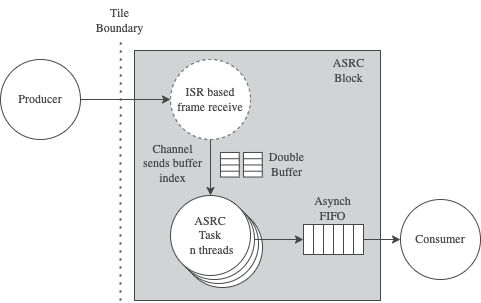

ASRC Task
---------

Introduction
............

The ASRC library provides a function call that operates on blocks of samples whereas typical XMOS audio IO libraries provide streaming audio one sample at a time. The ASRC task wraps up the core ASRC function with all of the other lower level APIs (eg. FIFO) and required logic. It provides a simple-to-use and generic ASRC conversion block suitable for integration into practical designs. It is fully re-entrant permitting multiple instances within a project supporting multiple (or bi-directional) sample rates and audio clock domain bridges.

Operation
.........

The ASRC task handles bridging between two asynchronous audio sources. It has an input side and output side. The input samples are provided over a channel allowing the source to be placed on a different XCORE tile if needed. The output side sample interface is via an asynchronous FIFO meaning the consumer must reside on the same XCORE tile as the ASRC.

Both input and output interfaces must specify the nominal sample rate required and additionally the input must specify a channel count. The output channel count will be set to the same as the input channel count automatically once the ASRC has automatically configured itself. A timestamp indicating the time of the production of the last input sample and the consumption of the first output sample must also be supplied which allows the ASRC to calculate the rate and phase difference. Each time either the input or output nominal sample rate or the channel count changes the ASRC subsystem automatically re-configures itself and restarts with the new settings.

The ASRC Task supports the following nominal sample rates for input and output:

    - 44.1 kHz
    - 48 kHz
    - 88.2 kHz
    - 96 kHz
    - 176.4 kHz
    - 192 kHz 

Because the required compute for multi-channel systems may exceed the performance limit of a single thread, the ASRC subsystem is able to make use of multiple threads in parallel to achieve the required conversion within the sample time period. It uses a dynamic fork and join architecture to share the ASRC workload across multiple threads each time a batch of samples is processed. The threads must all reside on the same tile as the ASRC task due to them sharing input and output buffers. The workload and buffer partitioning is dynamically computed by the ASRC task at stream startup and is constrained by the user at compile time to set maximum limits of both channel count and worker threads.

The number of threads that are required depends on the required channel count and sample rates required. Higher sample rates require more MIPS. The amount of thread MHz (and consequently how many threads) required can be *roughly* calculated using the following formulae:

    - Total thread MHz required for xcore.ai systems = 0.15 * Max channel count * (Max SR input kHz + Max SR output kHz)
    - Total thread MHz required for XCORE-200 systems = 0.3 * Max channel count * (Max SR input kHz + Max SR output kHz)

The difference between the performance requirement between the two architectures is due to xcore.ai supporting a Vector Processing Unit (VPU) which allows acceleration of the internal filters used by the ASRC. For example:

    - A two channel system supporting up to 192kHz input and output will require about (0.15 * (192 + 192) * 2) ~= 115 thread MHz. This means a single thread (assuming no more than 5 active threads on an xcore.ai device with a 600MHz clock) will likely be capable of handling this stream.

    - An eight channel system consisting of either 44.1kHz or 48kHz input with maximum output rate of 192kHz will require about (0.15 * (48 + 192) * 8) ~= 288 thread MHz. This can adequately be provided by four threads (assuming up to 8 active threads on an xcore.ai device with a 600MHz clock).

In reality the amount of thread MHz needed will be lower than the above formulae suggest since subsequent ASRC channels after the first can share some of the calculations. This results in about at 10% performance requirement reduction per additional channel per worker thread. Increasing the input frame size in the ASRC task may also reduce the MHz requirement a few % at the cost of larger buffers and a slight latency increase. 

.. warning::
    Exceeding the processing time available by specifying a channel count, input/output rates, number of worker threads or device clock speed may result in at best choppy audio or a blocked ASRC task if the overrun is persistent.

It is strongly recommended that you test the system for your desired channel count and input and output sample rates. An optional timing calculation and check is provided in the ASRC to allow characterisation at run-time which can be found in the `asrc_task.c` source code.

The low level ASRC processing function call API accepts a minimum input frame size of four whereas most XMOS audio interfaces provide a single sample period frame. The ASRC subsystem integrates a serial to block back to serial conversion to support this. The input side works by stealing cycles from the ASRC using an interrupt and notifies the main ASRC loop using a single channel end when a complete frame of double buffered is available to process. The ASRC output side is handled by the asynchronous FIFO which supports a block `put` with single sample `get` and thus provides de-serialisation intrinsically.

API & Usage
...........

The ASRC Task consists of a forever loop task to which various data structures must be declared and passed. The following items must be passed in:

    - A pointer to instance of the `asrc_in_out_t` structure which contains buffers, stream information and ASRC task state.
    - A pointer to the FIFO used at the output side of the ASRC task.
    - The length of the FIFO passed in above.

In addition the following two functions may be declared in a user `C` file (note XC does not handle function pointers):

    - The callback function from ASRC task which receives samples over a channel from the producer.
    - A callback initialisation function which registers the callback function into the `asrc_in_out_t` struct

If these are not defined, then a default receive implementation will be used which is matched with the send_asrc_input_samples_default() function on the user's producer side. This should be sufficient for typical usage.

An example of calling the ASRC task form and ``XC`` main function is provided below. Note use of `unsafe` permitting the compiler to allow shared memory structures to be accessed by more than one thread::

    chan c_producer;

    // FIFO and ASRC I/O declaration. Unsafe to allow producer and consumer to access it from XC
    #define FIFO_LENGTH     (SRC_MAX_NUM_SAMPS_OUT * 3) // Half full is target so *2 is nominal size but we need wiggle room at startup
    int64_t array[ASYNCHRONOUS_FIFO_INT64_ELEMENTS(FIFO_LENGTH, MAX_ASRC_CHANNELS_TOTAL)];

    unsafe{
        // IO struct for ASRC must be passed to both asrc_proc and consumer
        asrc_in_out_t asrc_io = {{{0}}};
        asrc_in_out_t * unsafe asrc_io_ptr = &asrc_io;
        asynchronous_fifo_t * unsafe fifo = (asynchronous_fifo_t *)array;
        setup_asrc_io_custom_callback(asrc_io_ptr); // Optional user rx function

        par
        {
            producer(c_producer);
            asrc_task(c_producer, asrc_io_ptr, fifo, FIFO_LENGTH);
            consumer(asrc_io_ptr, fifo);

        }
    } // unsafe region

An example of the user-defined `C` function for receiving the input samples is shown below along with the user callback registration function. The `receive_asrc_input_samples()` function must be as short as possible because it steals cycles from the ASRC task operation. Because this function is not called until the first channel word is received from the producer, the `chanend_in_word()` operations will happen straight away and not block::

    #include "asrc_task.h"

    ASRC_TASK_ISR_CALLBACK_ATTR // This is required for proper stack usage calculation by the compiler.
    unsigned receive_asrc_input_samples(chanend_t c_producer, asrc_in_out_t *asrc_io, unsigned *new_input_rate){
        static unsigned asrc_in_counter = 0;

        // Receive stream info from producer
        *new_input_rate = chanend_in_word(c_producer);
        asrc_io->input_timestamp = chanend_in_word(c_producer);
        asrc_io->input_channel_count = chanend_in_word(c_producer);

        // Pack into array properly LRLRLRLR or 123412341234 etc.
        for(int i = 0; i < asrc_io->input_channel_count; i++){
            int idx = i + asrc_io->input_channel_count * asrc_in_counter;
            asrc_io->input_samples[asrc_io->input_write_idx][idx] = chanend_in_word(c_producer);
        }

        // Keep track of frame block to ASRC task
        if(++asrc_in_counter == SRC_N_IN_SAMPLES){
            asrc_in_counter = 0;
        }

        return asrc_in_counter;
    }

    // Register the above function for ASRC task
    void setup_asrc_io_custom_callback(asrc_in_out_t *asrc_io){
        init_asrc_io_callback(asrc_io, receive_asrc_input_samples);
    }

Note that the producing side of the above transaction must match the channel protocol. For this example, the producer must send the following items across the channel in order:

    - The nominal input sample rate.
    - The input time stamp of the last sample received.
    - The input channel count of the current frame.
    - The samples from 0..n.

Because a `streaming` channel is used the back-pressure on the producer side will be very low because the channel outputs will be buffered and the receive callback will always respond to the received words.

This callback function helps bridge between `sample based` systems and the block-based nature of the underlying ASRC functions without consuming an extra thread.

The API for ASRC task is shown below:

.. doxygengroup:: src_asrc_task
   :content-only:

