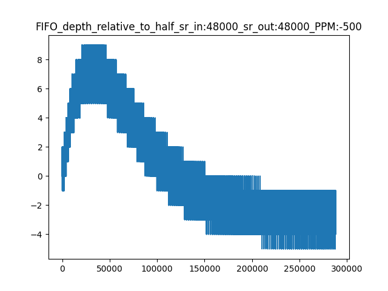

Asynchronous FIFO
=================

An Asynchronous FIFO is a non-blocking data structure in which elements
gets pushed in on one side and pulled out on the other side.
It is primarily designed to be used with the ASRC to help build practical
systems. The keys to this component are:

#. the non-blocking nature of the interfaces on both sides.

#. an the underlying assumption that software on both sides rate-matches
   their requests.

The asynchronous FIFO has a PID control inside it that can be used to
control the rate of either the producer or the consumer.

Two typical use cases are shown in :ref:`asynchronous_FIFO_use_cases`.
In te first use case we have an Asynchronous Sample Rate Converter (ASRC) in
front of the FIFO. The task of this ASRC is to dynamically introduce or
remove samples in order to match the rate of producer and consumer. In the
second use case we have a PLL (either hardware or software) that is used to
match the rate of the producer and consumer.

.. _asynchronous_FIFO_use_cases:

.. figure:: images/use-cases.*
            :width: 75%

            Use cases for the asynchronous FIFO

In order to use the asynchronous FIFO one needs at least two threads that
are located on the same tile. A producer thread (on the left), and a
consumer thread (on the right). These threads are free-running relative to
each other, and the FIFO transports data from the producer to the consumer.
Free-running means that the threads can simultaneously access the FIFO
without being able to observe a change in timing.

The FIFO has a fixed length, set on creation, and the control algorithm
inside the FIFO tries and keep the FIFO half-full at all times. When the
producer is slower than the consumer the FIFO will drain a bit until the
rates match again, and when the producer is faster than the consumer the
FIFO will grow until the rates match again. In order to ensure that the
FIFO stays half full, the control algorithm will always slightly overshoot
on a change in relative rates. Note that the FIFO is unaware whether it is
the producer that is too fast, or the consumer that is too slow. It does
not attribute blame for a rate-mismatch. The FIFO just observes the
mismatch.

Using the Asynchronous FIFO
---------------------------

An Asynchronous FIFO is allocated as an array of double-word integers::

  int64_t array[ASYNCHRONOUS_FIFO_INT64_ELEMENTS(ENTRIES, SAMPLE_SIZE)];

The ``ASYNCHRONOUS_FIFO_INT64_ELEMENTS()`` macro calculates the number of
double words required for the FIFO given the number of entries in the FIFO,
and the number of words that each sample occupies. For example, when
transferring stereo Audio through a fifo with 40 elements one would use
``ASYNCHRONOUS_FIFO_INT64_ELEMENTS(40, 2)``. Note that the two elements are
not interchangeable. The number 40 is the total number of elements in the
FIFO, in this case the FIFO will be started half-full, so the first 20
elements read will be zeroes, after which the produced data will appear on
the consumer side.

The number of elements in the FIFO is a trade-off that the system designer
makes. As the FIFO will always aim to be half-full, a large number of
elements will introduce a high latency in the system and occupy a large
amount of memory. A short FIFO wil contribute little latency but may easily
overflow and underflow. More on this in
:ref:`asynchronous_FIFO_three_degrees_of_freedom`.

The Asynchronous FIFO has the following functions to control the FIFO:

* ``asynchronous_fifo_init()`` initialises the FIFO structure. It needs to
  know the number of integers that comprise a single sample, the maximum
  length that has been allocated for the FIFO.

* ``asynchronous_fifo_exit()`` uninitialises the FIFO structure.

* ``asynchronous_fifo_producer_put()`` puts N samples into the FIFO. It
  needs a timestamp that is related to when sample N-1 was obtained.

* ``asynchronous_fifo_consumer_get()`` gets one sample from the FIFO. It
  must be given a timestamp related to when this (or the previous) sample
  is (was) output. It returns 0 if the pulled samples are valid.

All timestamps are measured in 100 MHz ticks.

The ``asynchronous_fifo_producer_put()`` function returns the current
rate-error observed between the producer and consumer. The rate-error is
typically a number close to one, eg, 1.00001231 or 0.99995442, and for
convenience the function returns epsilon, where ``epsilon = rate - 1``.
That is, it would return the values 0.00001231 or -0.00004558. This epsilon
is represented in a signed fixed point value Q32.32. Hence, given an ideal
rate the estimated rate is calculated as::

  est_rate = ideal_rate + ((epsilon * (int64_t) ideal_rate) >> 32)

in 32-bit precision or for 64-bit precision::

  est_rate = (((int64_t)ideal_rate) << 32) + epsilon * (int64_t) ideal_rate

Where ``ideal_rate`` is the expected value that would make producer and
consumer match if they had no error and ``epsilon`` is the value returned by
``asynchronous_fifo_producer_put()``. The number used for ``ideal_rate``
may be a PLL setting, or an ASRC ratio value. Note that the above maths can
be executed in a single multiply-accumulate instruction on XCORE.

It is important to note that the ``ideal_rate`` is never changed; the
estimated rate is a linear function combining the error and the ideal rate.
Internally the Asynchronous FIFO accumulates the errors so that the epsilon
returned will eventually stabilise.

The :ref:`ASRC Task <asrc_task_header>` provides an example of the integration of the FIFO with an ASRC.

.. _asynchronous_FIFO_three_degrees_of_freedom:

The three degrees of freedom
----------------------------

There are three degrees of freedom in this system:

* The length of the FIFO

* The time constant of the loop filter

* The jitter characteristics of the two clocks that can be sustained.

If you pick a long FIFO length, everything is great, but you introduce a
large delay between input-signal and output-signal. If you pick a short
time constant for the loop-filter, the adjustments of the ASRC will be
audible as harmonic distortion. If you only permit small changes between
the clocks, then you get away with a long time constant on the loop filter
and a short FIFO.

You can pick two and the third one has to match; given the jitter
characteristics and the time-constant the FIFO length follows.
Alternatively, given the jitter characteristics and the FIFO length the
maximum time constant for the loop-filter follows.

.. _asynchronous_FIFO_practical_sizing:

Practical FIFO sizing for ASRC usage
++++++++++++++++++++++++++++++++++++

Typically for most ASRC connected systems, the hardest case for the control loop is to stabilise at startup when the peak PPM difference is first seen. This results in a FIFO depth excursion from the half full state until the control loop has zeroed the error and the FIFO level has settled back to half full. It is not typical to see a large change in PPM difference during operation of practical systems; only small drifts due to voltage and temperature changes but a system always has a startup condition which needs to be accommodated.

The FIFO size must be at least twice the peak excepted perturbation to account for either a positive or negative PPM difference. Should the FIFO underflow or overflow due to insufficient depth it will reset and wait to be filled to half and attempt to close the loop again.

A typical FIFO depth plot at startup for a 500 PPM deviation is shown in the :ref:`fifo depth plot over samples consumed <fifo_startup_img>` image below. Note that the plot is a thick line because the ASRC produces on average four samples at a time whereas the FIFO is emptied one sample at a time. This "lumpiness" in the FIFO fill level means the real-time FIFO depth plot looks like a sawtooth waveform close up.

.. _fifo_startup_img:

            Peak FIFO excursion at startup for a 500 PPM deviation at 48 kHz output rate.

The size of the FIFO required depends on:

* The nominal output rate of the ASRC. This defines how quickly the FIFO fills. Higher rates require a larger FIFO.

* The PPM deviation from normal. This defines the maximum deviation of the nominal sample rates and the peak perturbation from half full. The PPM range of the input and output clocks must be added together. For example if your source can vary by up to +500 PPM and the sink can vary by -500 PPM then you must account for a 1000 PPM worst-case clock rate difference.

* The input block size multiplied by the maximum upsample ratio. This defines the "lumpiness" of the real-time FIFO level and needs to be taken account of to fully buffer the block being written. This needs to be supported in both positive and negative PPM cases.

Using the default constants for the loop filter (settings are conservative resulting in convergence time of around four seconds for a large step change in rate) and using the default (and minimum) input block size of four the FIFO should be sized to *at least*::

    FIFO_LEN = (OUTPUT_RATE * PPM / 16000000) + (2 * SRC_N_IN_SAMPLES x SRC_N_OUT_IN_RATIO_MAX)

It is a good idea to round up the FIFO_LEN to the nearest 2 to ensure it is symmetrical.

A few examples follow for an ASRC input block size of four. Note that the additional latency/group delay added to the system will nominally be half of FIFO depth divided by the output rate:

.. _required_fifo_length_table:
.. list-table:: Example minimum FIFO length setting
    :header-rows: 1

    * - Input Sample Rate
      - Output Sample Rate
      - Peak PPM difference
      - Minimum FIFO length
    * - 48000
      - 48000
      - 250
      - 16
    * - 48000
      - 48000
      - 500
      - 24
    * - 48000
      - 48000
      - 1000
      - 38
    * - 48000
      - 48000
      - 2000
      - 68
    * - 48000
      - 96000
      - 500
      - 46
    * - 48000
      - 192000
      - 500
      - 96
    * - 192000
      - 48000
      - 500
      - 20

.. note::
    The above settings are for the case when the timestamps are accurately measured. A time stamp relative offset between input and output values may require longer FIFO lengths since this may result in a FIFO nominal fill level away from half full.

.. note::
    Larger input block sizes will require longer FIFO lengths. Scaling the above number by around 1.5 for a block size of eight and 3.0 for a block size of 16 will help reduce the chance of a FIFO overflow or underflow during a frequency step change.

It is recommended to test your system to the maximum PPM tolerance across all supported sample rates to verify your chosen FIFO setting, especially if your goal is to minimise the latency by reducing the FIFO size, otherwise a conservative FIFO size setting may be applied at the cost of additional latency.

PID settings
------------

The PID constants can be set in two ways:

* When used with an ASRC they can be set based on input and output sample
  rates to a value that stabilises a 375 ppm change in approximately four
  seconds at 48,000 Hz.

* When used in other situations one can provide ones own Kp and Ki values.
  Both are represented as 32-bit integers, and a typical value for Ki is 422
  (at 48 KHz, smaller for higher frequencies), and a typical value for Kp
  is 28,000,000 (for X kHz to X KHz; higher when the input frequency goes
  up, smaller when the output frequency goes up).

API
---

.. doxygengroup:: src_fifo
   :content-only:

.. doxygengroup:: src_fifo_interp
   :content-only:

Internal workings of the Asynchronous FIFO
------------------------------------------

This appendix details the inner workings of the FIFO and is intended only
for advanced users who wish to understand the operation in more detail.

Measurements for the PID
++++++++++++++++++++++++

The Asynchronous FIFO uses the phase difference as the input for a PID
controller. The phase difference is shown in
:ref:`asynchronous_FIFO_phase_difference`. It is defined as the time difference
between a sample when it entered the queue and left the queue. Unlike
traditional phase differences that are measured in radians and where the
maximum phase difference is *+/- pi* , we measure the phase difference as a
time difference, and thereby allow the phase to be off by more than half a
sample.

.. _asynchronous_FIFO_phase_difference:

.. figure:: images/phase-difference.*
            :width: 75%

            Measurement of the phase difference

In a stable situation, we want the queue to be half-full, so we want the
phase difference to be half the maximum length of the FIFO multiplied by
the sample rate. For example, for a FIFO of 10 elements the ideal fill level is
5, and at 48 kHz the ideal phase error is 5 x 2.0833 us = 10.4166 us.
If the output is running slightly too fast then sample X will enter the
FIFO just after X-N/2 leaves the FIFO; if the output is running slightly
too slow than sample X will enter the FIFO just before X-N/2 leaves the
FIFO.

We define the *phase-error* as the difference between the ideal
phase-difference and the measured phase difference. Say that the queue has
filled up badly and stores 9 items, then the phase difference will account
for the 4 extra items in the FIFO, causing a phase difference 18.75 us
rather than the desired 10.4166 us, producing a phase error of between 8.33
us. The phase difference is notionally a continuous value (a time stamp) in
practice we measure it with the reference clock which has a 10 ns
granularity. However, that is of far higher granularity than whole samples
(2083 times better at a 48 KHz sample rate)

It is worth noting that the phase difference itself is an integral value;
it is the number of samples since the beginning of time that the ASRC is
out by. The goal of the rate converter is to make the phase difference
stable (ie, it does not move between subsequent samples), and zero (ie, the
FIFO is exactly mid level). Hence, we can see the differential of the phase
error as a proportional error, and the phase error itself as an integral
error.

Implementation of asynchronicity
++++++++++++++++++++++++++++++++

The FIFO straddles two threads; this is essential as the two threads
operate on different heart-beats. Hence, the FIFO is a shared-memory
element between those two threads. A read-pointer (managed
by the consuming thread) and a write-pointer (managed by the producing thread)
are maintained independently. The read-pointer and write-pointer are
normally N/2 elements apart.

During normal operation the Incoming and outgoing traffic are rate-matched,
and the read-pointer and write-pointer will be on opposite ends of the
circular buffer.

There are three situations where operation may be abnormal:

* Where the consumer is no longer consuming samples

* Where the producer is no longer producing samples

* Where a larger than expected change in the sample rates has caused the
  loop filter to require more than N/2 spaces away from the mid-point.

Detecting these cases requires us to calculate the modulo difference
between the write-pointer and read-pointer; if that difference is close to
zero the FIFO is about to underflow; if it is close to N the FIFO is about to
overflow. The notion "close to" is used since the read- and write-pointer
are updated independently by different threads, so the pointer may be one
less than anticipated, and we may miss an update. Underflow is detected by
the thread on the output side, overflow is detected by the thread on the
input side. Differentiating overflow/underflow from too large a change in
the sample rate may be hard and not necessary if they are all treated in
the same way.

The method we have chosen is to use two flags; RESET and DO_NOT_PRODUCE
that are owned by the consumer and producer sides respectively.

* The RESET flag is set by the consumer if it spots an underflow condition.
  Once RESET is set, the consumer will no longer advance the FIFO, return
  the same sample on each call, and wait for RESET to clear. Only the
  consumer may set RESET, only the producer may clear RESET.

* The DO_NOT_PRODUCE flag is set by the producer if it spots on overflow
  condition. Once set, the producer will no longer advance the FIFO, and
  wait for the consumer to set the RESET flag once it has come to an
  underflow (which must happen as the producer has stopped producing), at
  which point we get to the third action

* If the producer spots RESET being high, it resets the FIFO state except
  for the read-pointer; it leaves that as it is maintained by the consumer.
  Instead, it sets the write pointer to be at the other side of the buffer.
  Once the state is reset it will clear DO_NOT_PRODUCE and finally RESET,
  whereupon all should start running again.

Summary of communications and reset protocol
++++++++++++++++++++++++++++++++++++++++++++

In the thread on the producer side a ``put()`` operation performs the following:

  * If the RESET flag is set:

    #. Set the write-pointer to half-way from the read-pointer

    #. Set fs_ratio to 1

    #. Clear the phase error and reset all other PID state.

    #. Clear the DO_NOT_PRODUCE FLAG

    #. Clear the RESET flag (this is the last step, unlocking the consumer
       when it is safe to do so)

  * else if there is no room left in the FIFO to store all samples:

    #. Set the DO_NOT_PRODUCE flag

  * else if the DO_NOT_PRODUCE flag is not set:

    #. Copy N frames into the FIFO

    #. Increase the write-pointer

    #. Obtain a timestamp that was queued by the consumer

    #. Calculate the phase-error and the difference with the previous phase error

    #. Update the PID using the difference as the proportional error and
       the phase-error as the integral error.

In the thread on the consumer side a ``get()`` operation performs the following:

  * Copy the sample at the read-pointer into the buffer provided by the consumer

  * If the RESET flag is clear and there is at least one sample in the FIFO:

    #. Record the timestamp in the time-stamp queue

    #. Increase the read-pointer.

  * else if the RESET flag is clear:

    #. Set the RESET flag.
