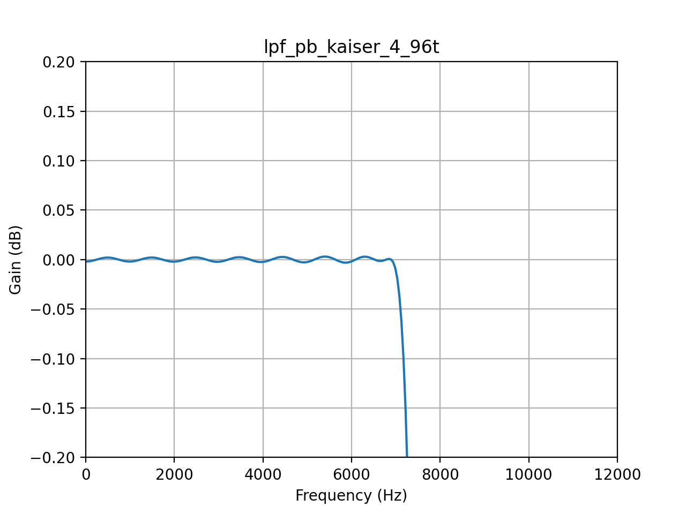

Fixed factor of 3 HiFi functions
================================

Overview
--------

The SRC library includes synchronous sample rate conversion functions to downsample (decimate) and oversample (upsample or interpolate) by a fixed factor of 3.

These components offer a high quality conversion with an SNR of 130 dB.

In each case, the processing is carried out each time a single output sample is required. In the case of the decimator, three input samples are passed to the filter with a resulting one sample output on calling the processing function. The interpolator produces an output sample each time the processing function is called but will require a single sample to be pushed into the filter every third cycle. All samples use Q1.31 format (left justified signed 32b integer).

Both sample rate converters are based on a 144 tap FIR filter with two sets of coefficients available, depending on application requirements:

 * firos3_b_144.dat / firds3_b_144.dat - These filters have 20 dB of attenuation at the Nyquist frequency and a higher cutoff frequency
 * firos3_144.dat / firds3_144.dat - These filters have 60 dB of attenuation at the Nyquist frequency but trade this off with a lower cutoff frequency

The default setting is to use the coefficients that provide 60 dB of attenuation at the Nyquist frequency.

The filter coefficients may be selected by adjusting the line::

  #define   FIROS3_COEFS_FILE

and::

  #define   FIRDS3_COEFS_FILE

in the files ``src_ff3_os3.h`` (API for oversampling) and ``src_ff3_ds3.h`` (API for downsampling) respectively.

The OS3 processing takes up to 153 core cycles to compute a sample which translates to 1.53 :math:`{\mu}s` at 100 MHz or 2.448 :math:`{\mu}s` at 62.5 MHz core speed. This permits up to 8 channels of 16 kHz -> 48 kHz sample rate conversion in a single 62.5MHz core.

The DS3 processing takes up to 389 core cycles to compute a sample which translates to 3.89 :math:`{\mu}s` at 100 MHz or 6.224 :math:`{\mu}s` at 62.5 MHz core speed. This permits up to 9 channels of 48 kHz -> 16 kHz sample rate conversion in a single 62.5MHz core.

Both downsample and oversample functions return ``ERROR`` or  ``NO_ERROR`` status codes as defined in the return code enums listed below. The only way these functions can error is if the passed `delay_base` structure member is uninitialized (NULL).

The downsampling functions return the following error codes ::

  FIRDS3_NO_ERROR
  FIRDS3_ERROR

The upsampling functions return the following error codes ::

  FIROS3_NO_ERROR
  FIROS3_ERROR

API
---

.. doxygenenum:: src_ff3_return_code_t

DS3 API
-------

.. doxygenstruct:: src_ds3_ctrl_t

.. doxygenfunction:: src_ds3_init

.. doxygenfunction:: src_ds3_sync

.. doxygenfunction:: src_ds3_proc

OS3 API
-------

.. doxygenstruct:: src_os3_ctrl_t

.. doxygenfunction:: src_os3_init

.. doxygenfunction:: src_os3_sync

.. doxygenfunction:: src_os3_input

.. doxygenfunction:: src_os3_proc

Fixed factor of 3 functions optimized for use with voice
========================================================

Overview
--------

A pair of SRC components supporting upconversion and downconversion by a factor of 3 are provided that are suitable for voice applications. They provide voice quality SNR (around 60 dB) and use a 72 tap Remez FIR filter and are optimized for the XS2 instruction set. 

.. warning::
    These SRC components have been deprecated. For new designs using XCORE-AI, please use the XS3 optimized components which provide both much better performance and use approximately half of the MIPS. See `ff3_voice_vpu_hdr`_

..
  .. doxygenvariable:: src_ff3v_fir_coefs_debug

..
  .. doxygenvariable:: src_ff3v_fir_coefs

Voice DS3 API
-------------

.. doxygenfunction:: src_ds3_voice_add_sample

.. doxygenfunction:: src_ds3_voice_add_final_sample

Voice US3 API
-------------

.. doxygenfunction:: src_us3_voice_input_sample

.. doxygenfunction:: src_us3_voice_get_next_sample

Fixed factor of 3 and 3/2 voice functions optimized for XS3
===========================================================

Overview
--------

A set of SRC components are provided which are optimized for the Vector Processing Unit (VPU) and are suitable for voice applications.
The fixed factor of 3 SRC components are designed for conversion between 48 kHz to 16 kHz and the fixed factor of 3/2 are designed for conversion between 48 kHz and 32 kHz.

They have been designed for voice applications and, in particular, conformance to the MS Teams v5 specification.

.. note::
    These filters will only run on XCORE-AI due to the inner dot product calculation employing the XS3 VPU.

.. warning::
    Synchronous fixed factor of 3 and 3/2 downsample and oversample functions for voice applications optimized for the XS3 Vector Processing Unit
    currently overflow rather than saturate in cases where a full scale input causes a perturbation above full scale at the output.
    To avoid this scenario, please ensure that the input amplitude is always 3.5 dB below full scale.
    The overflow behavior of these SRC components will be replaced by saturating behavior (to match all other SRC components) in a future release.

.. _ff3_voice_vpu_hdr:

Fixed factor of 3 VPU
---------------------

The filters use less than half of the cycles of the previous fixed factor of 3 functions but at the same time offer a much improved
filter response thanks to an increased filter length of 96 taps (compared with 72 taps) and use of a Kaiser window with a beta of 4.0.
The filter specification is shown in :numref:`src_ff3_vpu_filter`.

.. _src_ff3_vpu_filter:
.. list-table:: Fixed Factor of 3 Voice VPU SRC characteristics
    :header-rows: 1

    * - Filter
      - CPU cycles
      - Passband
      - Stopband
      - Ripple
      - Attenuation
      - Taps
    * - src_ff3_96t_ds
      - 104
      - 0.475
      - 0.525
      - 0.01 dB
      - 70 dB min
      - 96
    * - src_ff3_96t_us
      - 85
      - 0.475
      - 0.525
      - 0.01 dB
      - 70 dB min
      - 96

The fixed factor of 3 components produce three samples for each call passing one sample in the case of upsampling and produce a single sample for each call passing three samples in the case of downsampling.
All input and output samples are signed 32 bit integers. The filter characteristics are shown in :numref:`src_ff3_vpu` and :numref:`src_ff3_vpu_pb`.

.. _src_ff3_vpu:
.. figure:: images/src_ff3_vpu.png
   :width: 80%

   Fixed Factor of 3 Voice VPU SRC filter response

.. _src_ff3_vpu_pb:

  Fixed Factor of 3 Voice VPU SRC passband ripple

Voice DS3 API
-------------

.. doxygengroup:: src_ff3_96t_ds
   :content-only:

Voice US3 API
-------------

.. doxygengroup:: src_ff3_96t_us
   :content-only:

Fixed factor of 3/2 VPU
-----------------------

The fixed factor of 3/2 VPU sample rate converts use a rational factor polyphase architecture to achieve the non-integer rate ratio. Downsampling takes two phases while upsampling takes three. The filters have been designed with a Kaiser window with a beta of 3.2. The filter specification is shown in :numref:`src_ff3_2_vpu_filter`.

.. _src_ff3_2_vpu_filter:
.. list-table:: Fixed Factor of 3/2 Voice VPU SRC characteristics
    :header-rows: 1

    * - Filter
      - CPU cycles
      - Passband
      - Stopband
      - Ripple
      - Attenuation
      - Taps
    * - src_rat_2_3_96t_ds
      - 112
      - 0.46875
      - 0.53125
      - 0.03 dB
      - 70 dB
      - 96
    * - src_rat_3_2_96t_us
      - 95
      - 0.46875
      - 0.53125
      - 0.03 dB
      - 70 dB
      - 96

The fixed factor of 3/2 components produce three samples for each call passing two samples in the case of upsampling and produce two samples for each call passing three samples in the case of downsampling. 
All input and output samples are signed 32 bit integers. The filter characteristics are shown in :numref:`src_ff3_2_vpu` and :numref:`src_ff3_2_vpu_pb`.

.. _src_ff3_2_vpu:
.. figure:: images/src_rat_vpu.png
   :width: 80%

   Fixed Factor of 3/2 Voice VPU SRC filter response

.. _src_ff3_2_vpu_pb:
.. figure:: images/src_rat_vpu_pb.png
  :width: 80%

  Fixed Factor of 3/2 Voice VPU SRC passband ripple

Voice DS3/2 API
---------------

.. doxygengroup:: src_rat_2_3_96t_ds
   :content-only:

Voice US3/2 API
---------------

.. doxygengroup:: src_rat_3_2_96t_us
   :content-only:

